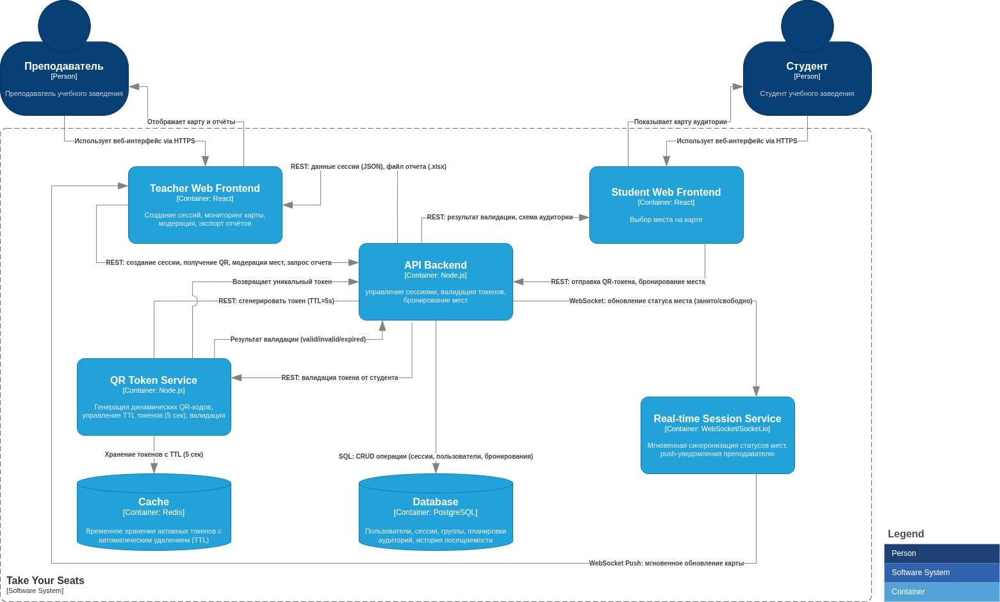

# Take Your Seats (TUS) — Web Application

> *"Everything in software architecture is a trade-off. First Law of Software Architecture"*

**TUS** — это надежная и прозрачная веб-система контроля посещаемости для учебных заведений. Она решает проблему ложных отметок с помощью динамических QR-кодов и визуализирует рассадку студентов на интерактивных картах в реальном времени.

---

## 📖 Table of Contents

- [Business Case](#-business-case)
- [System Context](#-system-context)
- [Containers](#-containers)
- [Requirements](#-requirements)
- [Constraints & Assumptions](#-constraints--assumptions)

---

## 💼 Business Case

Текущие методы контроля посещаемости в ВУЗах страдают от недостоверности и временных затрат на перекличку.

### Бизнес-цели:

| Цель | Описание |
|------|----------|
| **Достоверность** | Исключение возможности регистрации студентов вне аудитории |
| **Прозрачность** | Визуальная сверка карты приложения с реальной рассадкой студентов |
| **Эффективность** | Автоматизация формирования отчетности для преподавателей |

---

## 🎯 System Context

На приведенной ниже диаграмме системного контекста показаны ключевые пользователи системы и ее внешние зависимости:

---

## 📦 Containers

На приведенной ниже диаграмме контейнеров показана высокоуровневая структура архитектуры программного обеспечения и то, как распределяются обязанности между контейнерами. На ней также показаны основные технологические решения и то, как контейнеры взаимодействуют друг с другом.

---

## 📋 Requirements

### Stakeholders

| ID | Роль | Описание |
|----|------|----------|
| **SH-1 ** | Преподаватель | Управляет сессиями занятий, модерирует рассадку и контролирует отчетность |
| **SH-2 ** | Студент | Осуществляет регистрацию на занятии и отметки своего физического места |

### Functional Requirements

| ID | Требование | Описание |
|----|------------|----------|
| **FR-1 ** | Управление сессией | Преподаватель может создать учебную сессию, выбрав аудиторию, дисциплину и группу |
| **FR-2 ** | Генерация QR | Система генерирует уникальный QR-код с временным токеном, обновляющимся каждые 10 секунд |
| **FR-3 ** | Интерактивная карта | Студент получает доступ к схеме аудитории только после сканирования валидного QR |
| **FR-4 ** | Бронирование | Студент отмечает место через механизм «Выбор места на схеме» → «Подтверждение выбора» |
| **FR-5 ** | Мониторинг | Система мгновенно обновляет статус мест на карте преподавателя (свободно/занято) в реальном времени |
| **FR-6 ** | Модерация | Преподаватель может принудительно освободить любое место на карте кликом |
| **FR-7 ** | Экспорт | Автоматическая генерация отчета в формате `.xlsx` |

### Non-Functional Requirements

| ID | Категория | Требование |
|----|-----------|------------|
| **NFR-1** | Security | Срок жизни (TTL) динамического токена в QR-коде — **10 секунд** |
| **NFR-2** | Usability | Интерфейс оптимизирован под мобильные браузеры (100% студентов сканируют со смартфонов) |
| **NFR-3** | Availability | Система доступна для работы в часы проведения занятий согласно расписанию вуза |

---

## 🚧 Constraints & Assumptions

### Constraints
| ID | Описание |
|----|----------|
| **CON-1** | Система доступна через браузер без установки ПО |
| **CON-2** | Предварительная интеграция планировок аудиторий в БД |

### Assumptions
| ID | Описание |
|----|----------|
| **ASM-1** | Веб-интерфейс является основной точкой взаимодействия |
| **ASM-2** | Студенты обеспечены смартфонами с доступом в интернет |
| **ASM-3** | Аудитории оборудованы экранами для демонстрации QR-кода |

---
